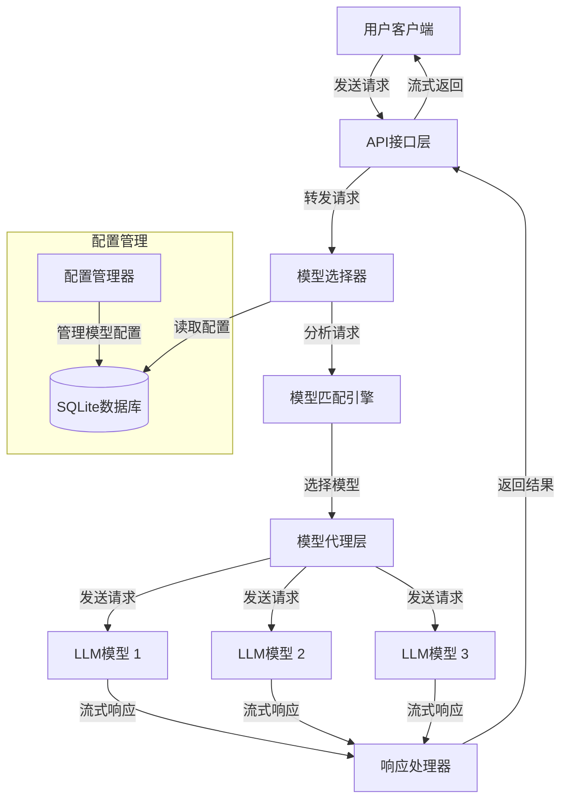

# LLM MOE 选择系统

## 目录

* [功能特点](#功能特点)
* [系统架构](#系统架构)
* [安装与设置](#安装与设置)
* [使用方法](#使用方法)
* [自定义与扩展](#自定义与扩展)
* [许可证](#许可证)

这是一个基于 Node.js 的 LLM MOE (Mixture of Experts) 选择系统，能够根据用户的请求内容智能匹配最适合的大语言模型来处理查询。

## 功能特点

* 提供与 OpenAI 兼容的 API 接口
* 支持多种 LLM 模型配置管理
* 智能模型选择器，根据用户请求内容自动选择最合适的模型
* 支持流式响应输出
* 模块化设计，易于扩展
* 使用 SQLite + Prisma 进行数据管理

## 系统架构

<details>
<summary>点击展开系统架构图</summary>



</details>


## 安装与设置

### 先决条件

* Node.js 18+
* npm 或 yarn

### 安装步骤

1. 克隆代码库

   ```bash
   git clone <repository-url>  # 将 &lt;repository-url&gt; 替换为实际的仓库 URL
   cd llm-moe-selector
   ```

2. 安装依赖

   ```bash
   npm install
   ```

3. 配置环境变量

   编辑 `.env` 文件，设置必要的 API keys 和其他配置

4. 初始化数据库

   ```bash
   npx prisma migrate dev --name init
   npm run setup  # 创建初始模型配置
   ```

5. 启动服务

   ```bash
   npm start
   ```

## 使用方法

### API 端点

* **POST /v1/chat/completions**: 与 OpenAI 兼容的聊天接口

  ```bash
  curl -X POST http://localhost:3000/v1/chat/completions \
    -H "Content-Type: application/json" \
    -d '{
      "messages": [{"role": "user", "content": "你好，请解释量子力学"}],
      "stream": true
    }'
  ```

* **模型配置管理 API**:
  * GET /api/models - 获取所有模型配置
  * GET /api/models/:modelId - 获取单个模型配置
  * POST /api/models - 创建新模型配置
  * PUT /api/models/:modelId - 更新模型配置
  * DELETE /api/models/:modelId - 删除模型配置

### 添加新模型

通过 API 添加新模型配置:

```bash
curl -X POST http://localhost:3000/api/models \
  -H "Content-Type: application/json" \
  -d '{
    "modelId": "llama-3-70b",
    "name": "Llama 3 70B",
    "description": "元开源大语言模型，适合多语言任务",
    "baseUrl": "https://your-llama-api-endpoint",
    "apiKey": "your-api-key",
    "prompt": "你是一个由Meta开发的开源AI助手。",
    "capabilities": "[\"多语言处理\",\"知识问答\",\"指令跟随\"]",
    "priority": 7,
    "isActive": true
  }'
```

## 自定义与扩展

### 修改选择器策略

修改 `src/services/modelSelector.js` 中的 `DEFAULT_PROMPT_TEMPLATE` 以调整模型选择策略，或者实现自己的选择算法。

### 添加新的功能

系统采用模块化设计，可以通过添加新的服务和路由轻松扩展功能。

## 许可证

MIT
